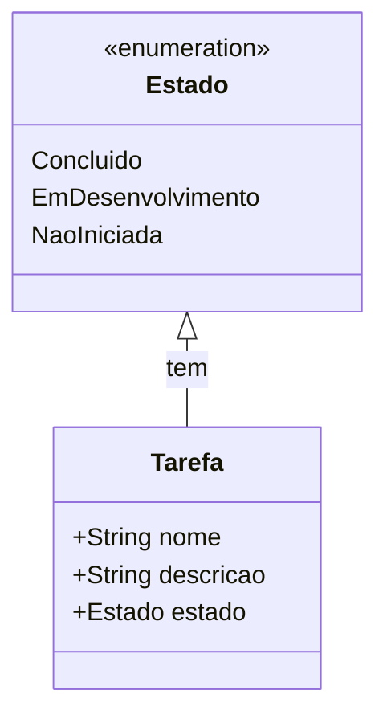

#DIO Backend em Java

Java Restful API criada para o curso de Backend em Java da Digital Innovation One.

##Diagrama de Classes

```mermaid

classDiagram
    class Tarefa {
        +String nome
        +String descricao
        +Estado estado
    }

    class Estado {
        <<enumeration>>
        Concluido
        EmDesenvolvimento
        NaoIniciada
    }

    Estado <|-- Tarefa : tem

```
